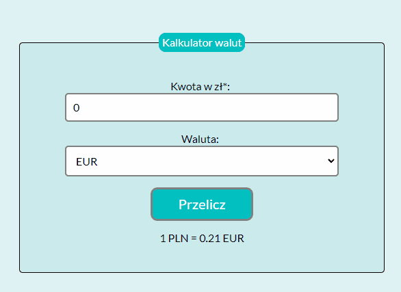

# Welcome on my first currency-converter
Hello everyone.
Check out my simple [currency converter.](https://mikaeloangelloo.github.io/currency-converter/)

# Description
That's my first simple currency converter. You can exchange PLN to EUR, USD or CHF.
# Technologies used in the project:
- HTML;
- CSS;
- JavaScript;
- BEM.
